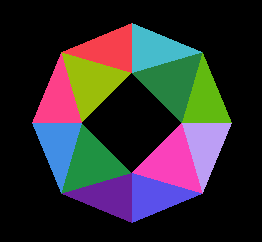
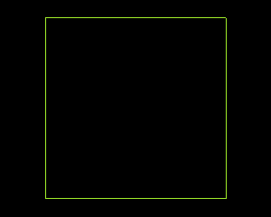
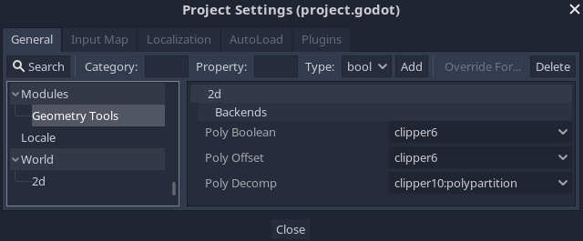

# Godot GeometryTools

[](https://travis-ci.com/Xrayez/godot-geomtools)
[](https://ci.appveyor.com/project/Xrayez/godot-geomtools/branch/master-gd3)

This is a [Godot](https://github.com/godotengine/godot) module which provides
various geometry methods and aims to build upon the existing `Geometry` singleton.




## Overview

The module exposes a `GeometryTools2D` singleton with the methods for performing
polygon clipping, offsetting (deflating/buffering) and decomposition
(triangulation, convex decomposition), as well as providing polypath queries
such as polygon area, centroid of a polygon, point in polygon, and generating
geometrical shapes at run-time.

The interface is similar to what you can see in the `Geometry` singleton
regarding polygon clipping and offsetting first introduced in
[Godot Engine 3.2](https://github.com/godotengine/godot/pull/28987), yet the
module brings many other possibilities such as multiple polygon clipping (with
holes), building polygon hierarchies, and other specific and hidden features.

Each class of the methods are implemented by their respective back-ends and can
be switched at run-time via the `ProjectSettings`, see below instructions.

Here's a quick overview of the currently implemented methods:

## 2D

### Polygon boolean operations
| Method                                       | Description                                                                      |
| -------------------------------------------- | -------------------------------------------------------------------------------------- |
| `merge_polygons`                             | Merges individual polygons into one.                                                   |
| `clip_polygons`                              | Clips a subject polygon with another one.                                              |
| `intersect_polygons`                         | Returns a polygon where both polygons overlap.                                         |
| `exclude_polygons`                           | Mutually excludes common area defined by polygons.                                     |
| `merge_multiple_polygons`                    | Similar to `merge_polygons`, but accepts an array of polygons.                         |
| `clip_multiple_polygons`                     | Similar to `clip_polygons`, but accepts an array of polygons.                          |
| `intersect_multiple_polygons`                | Similar to `intersect_polygons`, but accepts an array of polygons.                     |
| `exclude_multiple_polygons`                  | Similar to `exclude_polygons`, but accepts an array of polygons.                       |
| `polygons_boolean`                           | Performs a polygon boolean operation from `PolyBooleanOperation` on multiple polygons. |
| `polygons_boolean_tree`                      | Similar to `polygons_boolean`, but returns an hierarchy of nested polygons.            |
| `clip_polyline_with_polygon`                 | Cuts a polyline with a polygon.                                                        |
| `intersect_polyline_with_polygon`            | Chops a polyline with a polygon.                                                       |
| `clip_multiple_polylines_with_polygons`      | Similar to `clip_polyline_with_polygon`, but accepts an array of polypaths.            |
| `intersect_multiple_polylines_with_polygons` | Similar to `intersect_polyline_with_polygon`, but accepts an array of polypaths.       |

### Polygon offsetting
| Method                       | Description                                                                              |
| ---------------------------- | ---------------------------------------------------------------------------------------------- |
| `inflate_polygon`            | Shrinks a polygon inward.                                                                      |
| `deflate_polygon`            | Grows a polygon outward.                                                                       |
| `inflate_multiple_polygons`  | Similar to `inflate_polygon`, but accepts an array of polygons which may be joined together.   |
| `deflate_multiple_polygons`  | Similar to `deflate_polygon`, but accepts an array of polygons which may be joined together.   |
| `deflate_polyline`           | Grows a polyline into a polygon outward.                                                       |
| `deflate_multiple_polylines` | Similar to `deflate_polyline`, but accepts an array of polylines which may be joined together. |
| `offset_polygon`             | Either shrinks or grows a polygon by `delta` pixels.                                           |
| `offset_multiple_polygons`   | Similar to `offset_polygon`, but accepts an array of polygons which may be joined together.    |

### Polygon decomposition
| Method                                    | Description                                                                                  |
| ----------------------------------------- | -------------------------------------------------------------------------------------------------- |
| `triangulate_polygon`                     | Triangulates a polygon using the ear clipping algorithm (default).                                     |
| `triangulate_multiple_polygons`           | Similar to `triangulate_polygon`, but accepts an array of both outer and inner polygons.           |
| `decompose_polygon_into_convex`           | Decomposes a polygon into smaller convex polygons using the Hertel-Mehlhorn algorithm (default).       |
| `decompose_multiple_polygons_into_convex` | Similar to `decompose_polygon_into_convex`, but accepts an array of both outer and inner polygons. |
| `decompose_polygons`                      | Decomposes polygons using any of the available algorithms from `PolyDecompType`.                   |

### Polygon and polyline queries
| Method              | Description                                                               |
| ------------------- | ------------------------------------------------------------------------------- |
| `polygon_centroid`  | Returns the center of mass of a polygon.                                        |
| `polygon_area`      | Returns the signed area of a polygon.                                           |
| `polygon_perimeter` | Returns the perimeter of a polygon.                                             |
| `polyline_length`   | Returns the total length of a polyline.                                         |
| `point_in_polygon`  | Tells whether a point lies inside, outside, or exactly on a polygon's boundary. |

### Polygon and shapes generation
| Method            | Description                                                                                       |
| ----------------- | ------------------------------------------------------------------------------------------------------- |
| `regular_polygon` | Returns a regular polygon with all equal sides and angles (triangle, rectangle, pentagon, hexagon etc.) |
| `circle`          | Returns vertices approximating a circle given the maximum error.                                        |

## Installation

Before installing, you must be able to 
[compile Godot Engine](https://docs.godotengine.org/en/latest/development/compiling/) 
from source.

```bash
# Change directory to `modules` subfolder of Godot repository
cd godot/modules/
# Clone the module under directory named `geomtools`
git clone https://github.com/Xrayez/godot-geomtools.git geomtools && cd ..
# Compile the engine manually, for instance:
scons platform=windows target=release_debug bits=64
```

## Configuring at run-time

### Switching backends

There are a handful of back-ends to choose from:

| Class             | Backends                                   | Default                   |
| ----------------- | ------------------------------------------ | ------------------------- |
| `poly_boolean_2d` | `clipper6`, `clipper10`                    | `clipper6`                |
| `poly_offset_2d`  | `clipper6`, `clipper10`                    | `clipper6`                |
| `poly_decomp_2d`  | `clipper10:polypartition`, `polypartition` | `clipper10:polypartition` |

#### Differences

`clipper6` backend implements both polygon clipping and offsetting. Uses
[Clipper 6.4.2
stable](https://sourceforge.net/p/polyclipping/code/HEAD/tree/trunk/) version
which is bundled with Godot Engine since 3.2 out-of-the-box.

Experimental `clipper10` backend implements most major features which `clipper6`
provides, with an additional ability to triangulate the clipping output. Uses
[Clipper 10.0.0 sandbox](https://sourceforge.net/p/polyclipping/code/HEAD/tree/sandbox/Clipper2/)
version which is still under development.

`polypartition` backend takes advantage of the existing
[PolyPartition](https://github.com/ivanfratric/polypartition) library bundled
with the Godot Engine.

`clipper10:polypartition` is an extension to `polypartition` backend which
provides a more robust triangulation method (handles degenerate polygons), and
shadows an internal bug present in `polypartition`'s `Triangulate_MONO` method.

All of these can be set via the `modules/geometry_tools` options present in the
`ProjectSettings` (once you open Godot editor the default settings will be set
automatically):



## Configuring at compile-time

### Command line options

| Name                     | Description                                                                                                                                                      |
| ------------------------ | ---------------------------------------------------------------------------------------------------------------------------------------------------------------- |
| `geomtools_scale_factor` | The precision used for converting between the integer and the float coordinates. Beware of the too high scale factors as it may lead to integer overflow issues. |

For instance:
```
scons geomtools_scale_factor=1e3
```

## Contributing
     
See [Contributing](CONTRIBUTING.md) if you are interested in extending the
module in any way.

The module lacks implementation on 3D, so feel free to be the first one to
contribute in this area.

Any new features are encouraged to be developed against the latest Godot
Engine's *stable* version, and later ported to the latest engine's *development*
version.

## License

The module is under the [MIT license](LICENSE.md).

See the full list of third-party libraries at [thirdparty/README.md](thirdparty/README.md).
